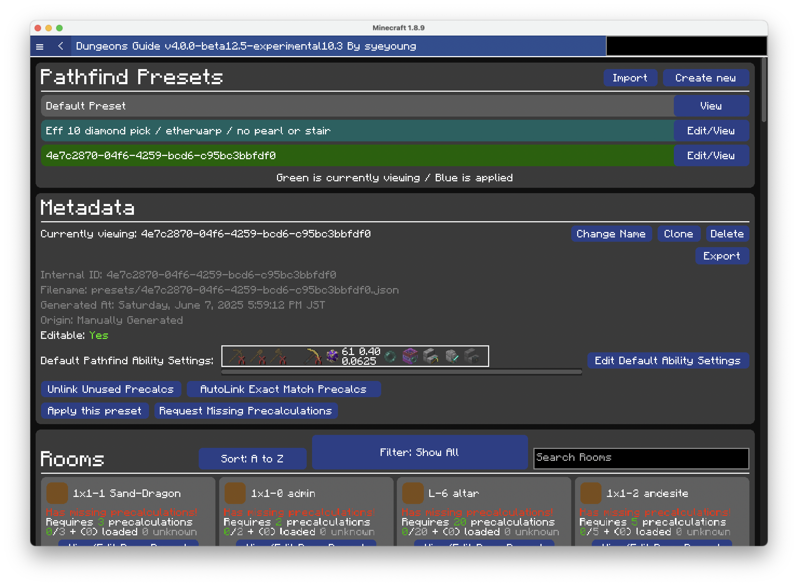
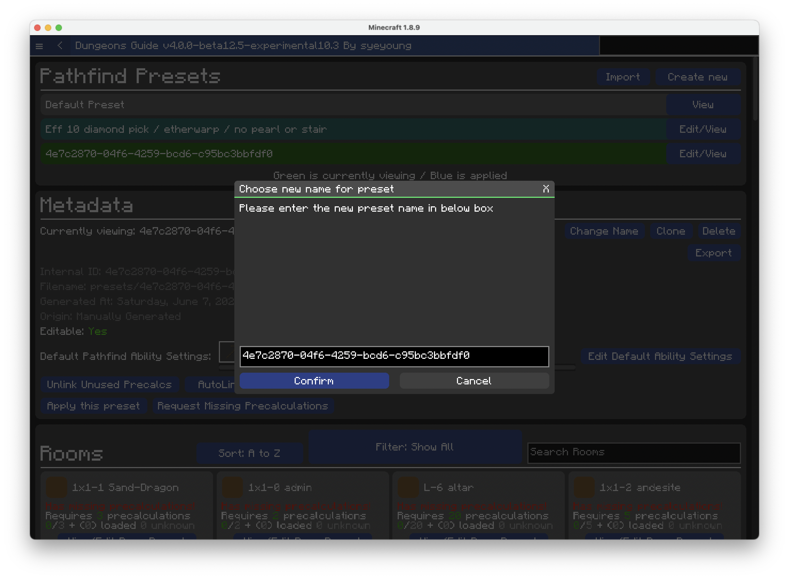
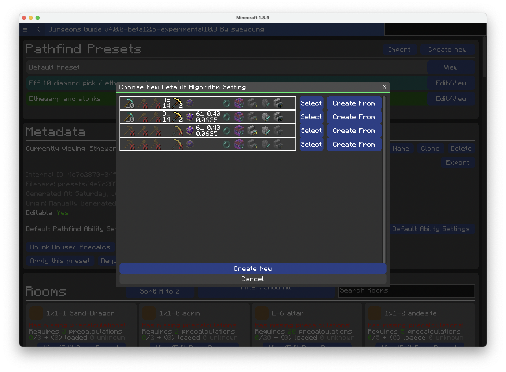
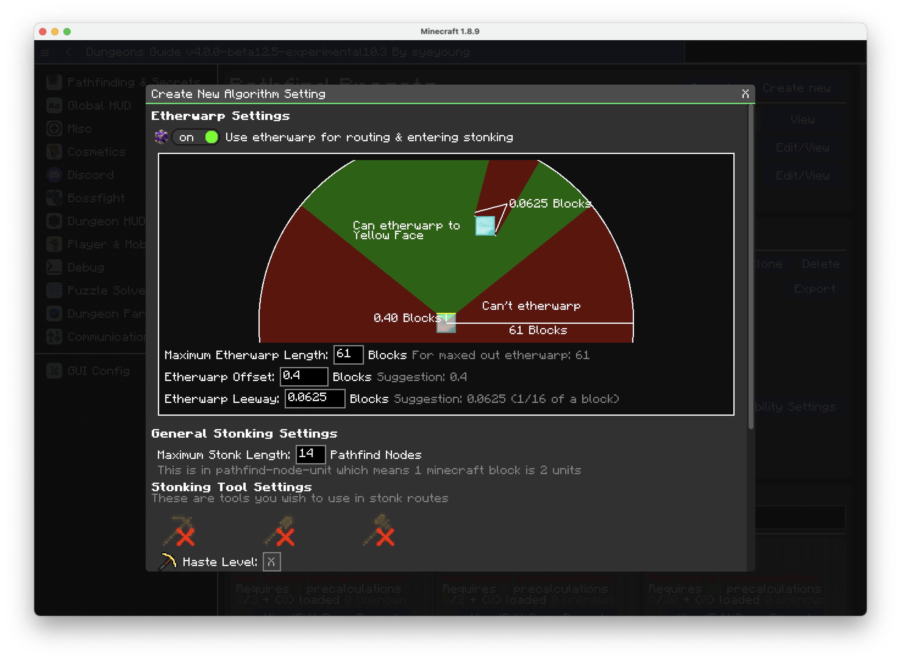
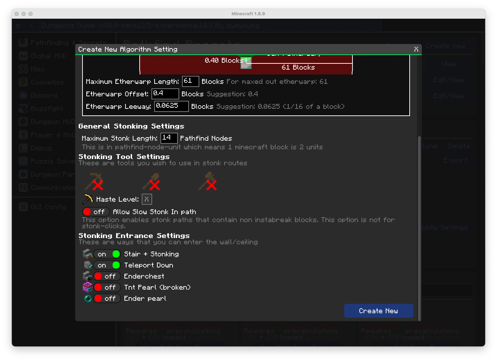

# Creating Preset

Presets can be newly created in Dungeons Guide to fit your needs.

Especially the Ability Settings allow you to specify
- Stonk settings
- Etherwarp settings
- Stair Stonk
- Enderpearl
- Etc.

### Step 1. Go to presets ui

Open `/dg -> Pathfinding & Secrets -> Precalculations`. You'll be greeted with following screen

### Step 2. Create new preset

Click `Create new` on top right. New preset will be created and opened.

You can also choose to clone pre-existing preset. Please note precalculation link data will also be copied over when you click clone.

### Step 3. Change name

Click `Change name` on top right. Give the newly generated preset a new anme

### Step 4. Change abiltiy settings

Click `Edit Default Abiltiy Settings`

You can do multiple things in the list
- You can select pre-existing ability setting and use it by clicking `Select`
- You can create new ability setting from pre-existing ability setting by clicking `Create From`
- You can create new ability setting from scratch by clicking `Create New`

Here's a light overview of how to read icons
- 3 tools on left with numbers or X indicate: the material of the tool, and the efficiency level. Wooden tool with X means that specific tool is not used for stonking.
- D=number, shows maximum stonk distance. 14 means dg will allow 7 block stonk paths.
- Haste icon shows haste level
- The icon next to haste icon is "Etherwarp Conduit". If it's bright, it means etherwarp is enabled. It will also show some parameters for etherwarp
- The number on top left is etherwarp distance, to the right it's etherwarp offset, and at the bottom it's etherwarp leeway. Those values will make a lot of sense in `Create New`
- To the right you can see enderpearl, tnt pearl, stair stonk, wall + teleport, chest stonk which is used to enter a block. (Please note tnt pearl has been patched but it still exists in the settings)

In this tutorial, we will generate new ability setting.

### Step 5. Create new ability settings.

Click `Create New`

After tweaking the settings, click `Create New`

### Step 6. Apply newly created ability settings

From 

Choose the created ability setting and click `Select`

### Step 7. Optional: Autolink Exact Match Precalcs

If some precalculation on your pc can be linked to the preset, `AutoLink Exact Match Precalcs` will link those precalculations to the preset.

### Step 8. Optional: Request Missing Precalculations

If you're going to use this preset, you need to precalculate. The guide can be found [here](/docs/pathfinding/precalculation/introduction)

### Step 9. Optional: Apply this preset and use it as default

You can also click on `Apply this preset` on bottom left to set this preset as default.