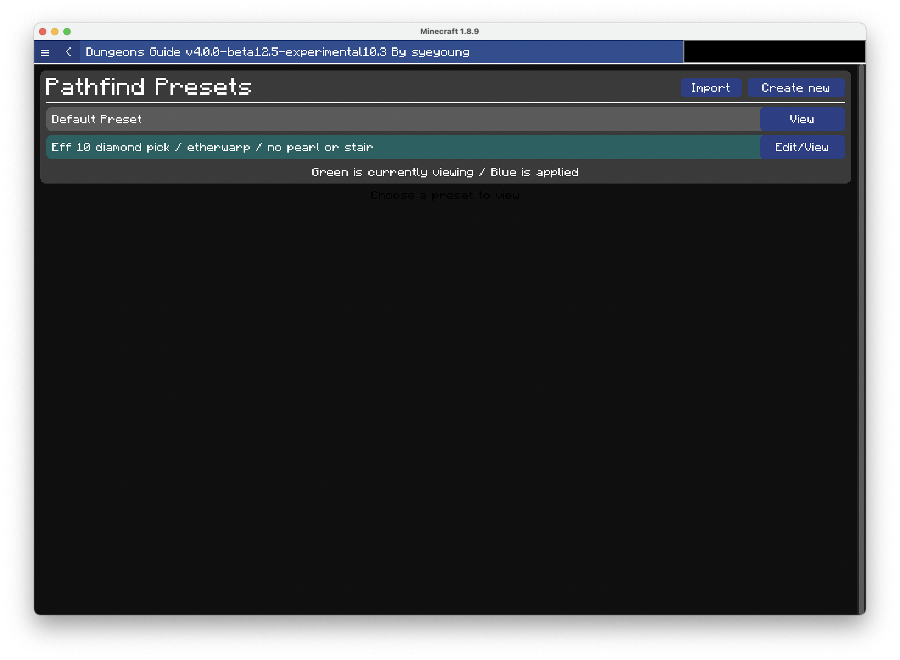
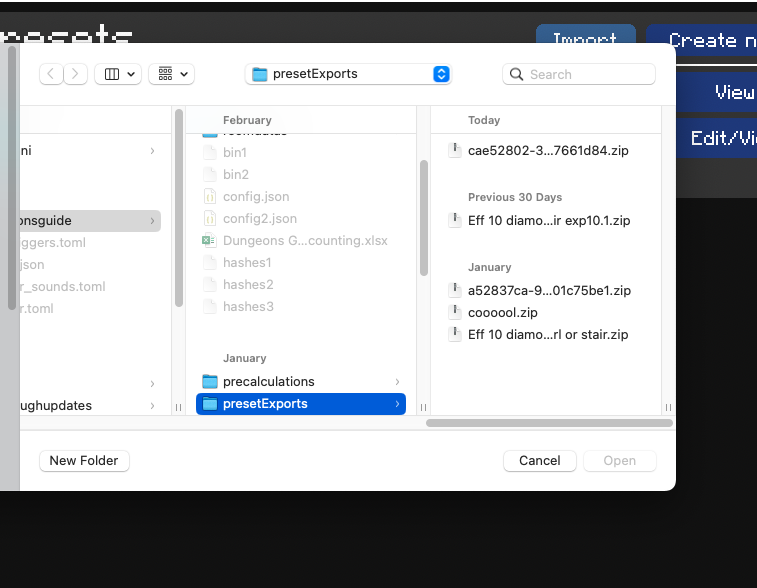
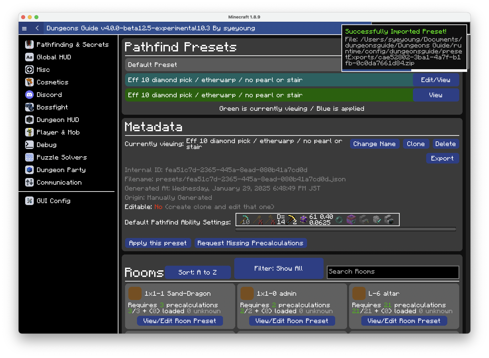

# Importing Preset

You can import pathfind preset from others in Dungeons Guide.

Presets can contain precalculations, which make exporting/importing presets useful.

### Step 1. Go to presets ui

Open `/dg -> Pathfinding & Secrets -> Precalculations`. You'll be greeted with following screen

### Step 2. Import preset

Click `Import` and choose the preset export zip that you wish to import.

### Step 3. Done!

The preset will be imported and you can now apply the preset if you wish to use it in the runs.