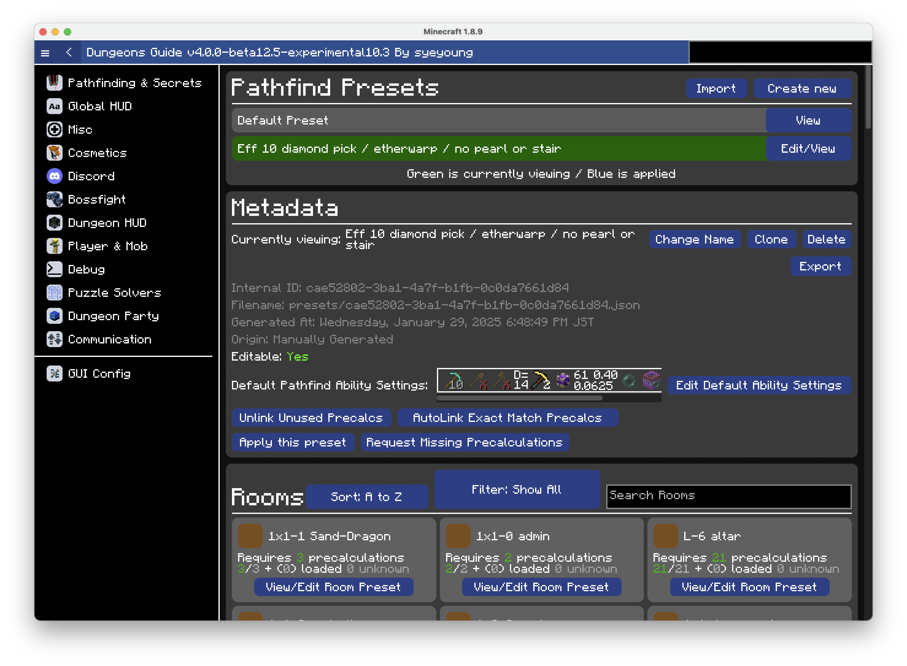
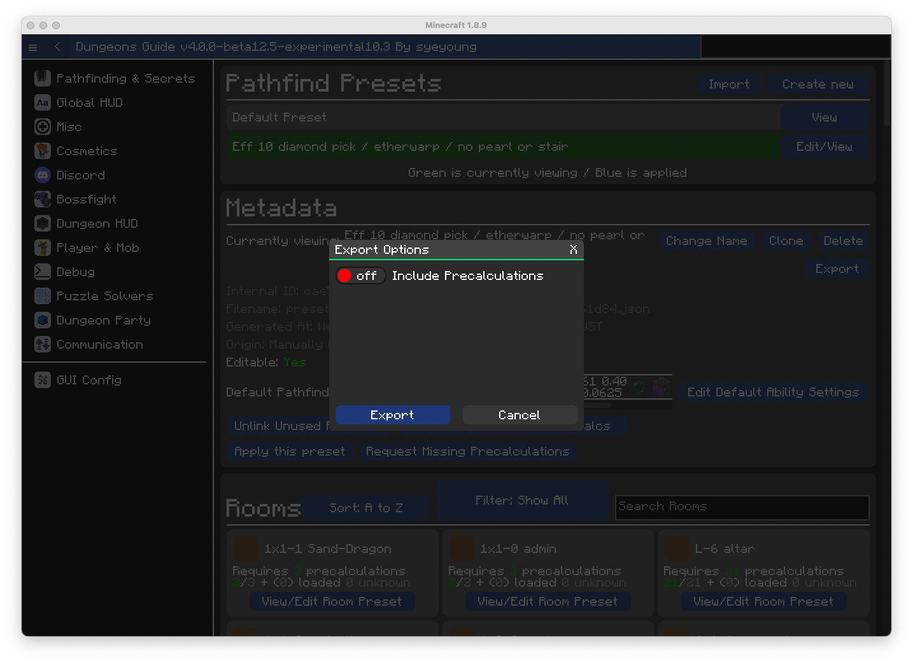
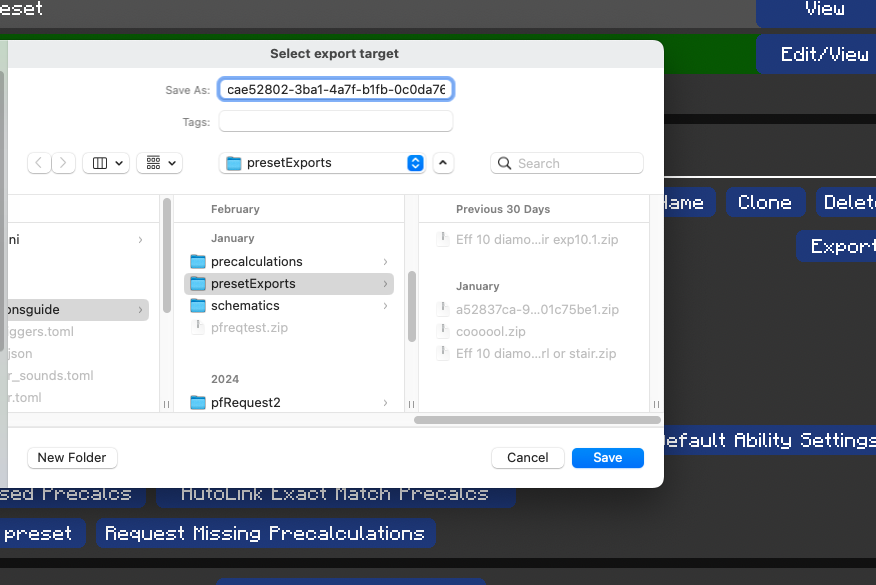
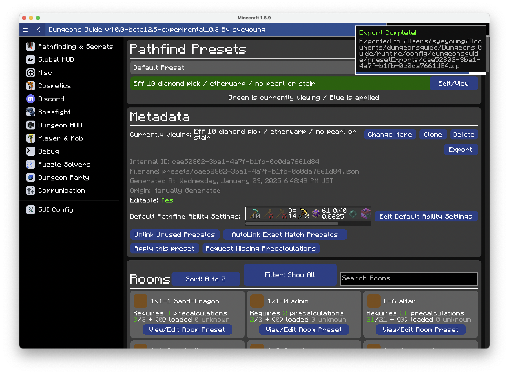

# Exporting Preset
You can export pathfind preset from others in Dungeons Guide.

Presets can contain precalculations, which make exporting/importing presets useful.

### Step 1. Go to presets ui

Open `/dg -> Pathfinding & Secrets -> Precalculations`. You'll be greeted with following screen

### Step 2. Choose the preset you wish to export

From the ui, click `View` or `View/Edit` on the preset you wish to export.

### Step 3. Export

Click `Export` button. 

If you wish to include precalculation as the part of export, turn `Include Precalculation` on.

Click `Export` button.

You will get a file dialog.

Rename the export and change the export directory, and click `Save`

You have successfully exported the preset and you can now share the resulting zip file!