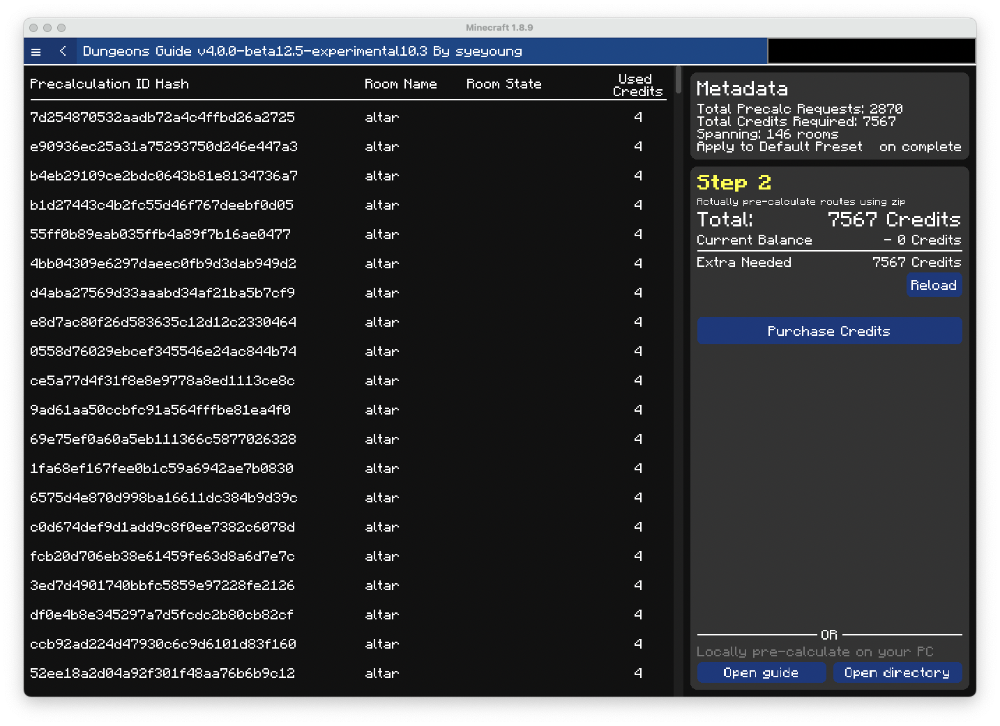

# Precalculate on Cloud

This is a step by step tutorial on how to do precalculation on the cloud.

:::info

Precalculation on the cloud requires pathfinding credit to be purchased from the [store](https://store.dungeons.guide/)

Running Precalculation on all secrets with etherwarp and stonk enabled takes around 10000 pathfinding credits.

:::

### Step 1. Make sure you have preset ready

Following `/dg -> Pathfinding & Secrets -> Precalculations` You'll be greeted with following page.

Click `View` or `Edit/View` on the preset that has your desired ability settings, or proceed after creating one following the [guide](/docs/pathfinding/presets/creating-preset)

The chosen preset will be highlighted with green

Confirm your default pathfind ability settings on the preset.

### Step 2. Request missing precalculations

Click the button named `Request Missing Precalculation`.

Here confirm 
- required pathfind credits.
- the name of preset
- the # of precalc requests
- Estimated time

The value depends on your computer, but in the screenshot 
- 7567 credits are required
- the preset is named Default Preset
- there are 2870 precalc requests
- it is estimated to take about 35 minutes

### Step 3. Generate Zip

After you have confirmed the values, click generate zip.

Progress bar will appear showing current progress of generating precalculation requests.

It takes few minutes to generate all precalculation requests.

After it has generated all the requests it will continue with zipping the requests.

### Step 4. Purchase Credits if needed

If you're missing required credits, the following screen will appear

Click purchase credits, and after the purchase is done click `Reload`

### Step 5. Request precalculation

Click Request Pathfind to request precalculation.

It will start uploading file to the cloud.

After it's done, the following screen will appear

### Step 6. View progress and wait

You can either 
- click `View Progress` on the page 
- go to `/dg -> Pathfinding & Secrets -> Request path calculation` and click `View` on your precalculation request under `Remote Pathfind Precalculations`  

The progress page will look like this

After closing the config screen, You may turn off minecraft, or you can decide to play skyblock while precalculation is being done.
Please note that currently there is no notification on when precalculation is done. 

When the events show bunch of `Make Batch`, the pathfinding precalculaation coordiantor on the cloud is distributing precalculation requests to multiple machines.

### Step 7. Download and Apply

Please visit precalculation progress page from Step 6

It should show something like this

Click `Download and Auto Apply Result`

It will show you progress bar like this

Please wait until pathfind precalculation is fully downloaded and applied

### Step 8. Confirm the precalculations

Go back to `/dg -> Pathfinding & Secrets -> Precalculations` and choose the preset you requested precalculation on.

Click on `Sort` to change it to `Sort: # of missing precalculation` and confirm that the preset is not missing any precalculations

If your new preset is not set to default (i.e. applied), Click `Apply this preset` to apply it and use it in your runs.

### Step 9. Done!

You have successfully precalculated for a preset and applied the resulting precalculations.

Please note any change to ability setting in the preset will require the precalculations to be recalculated to reflect those new ability settings.

Use the `clone` button to clone preset first then change abiltiy setting. 