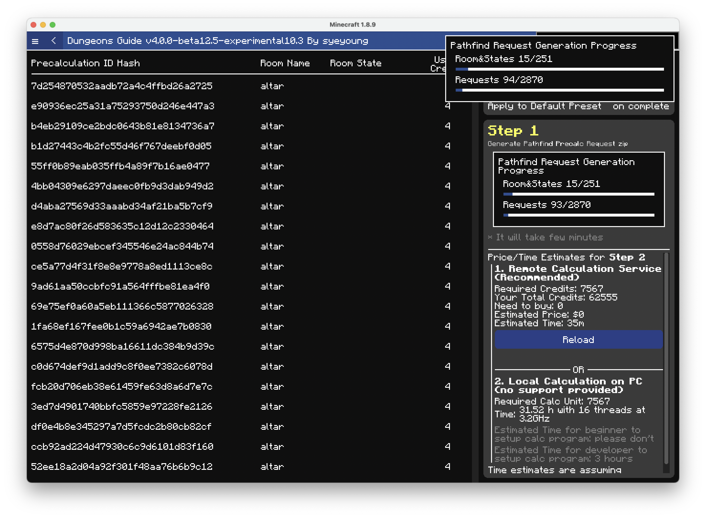
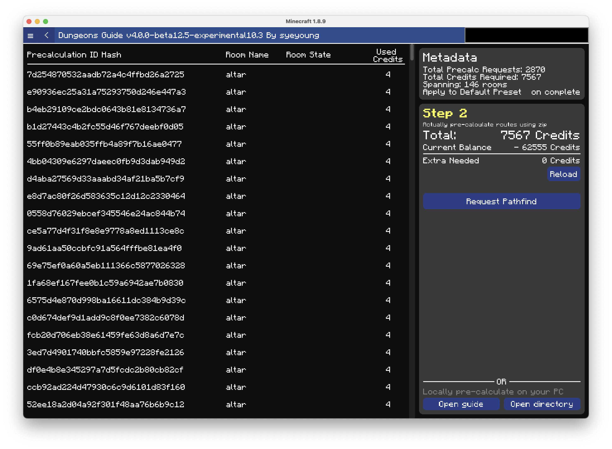
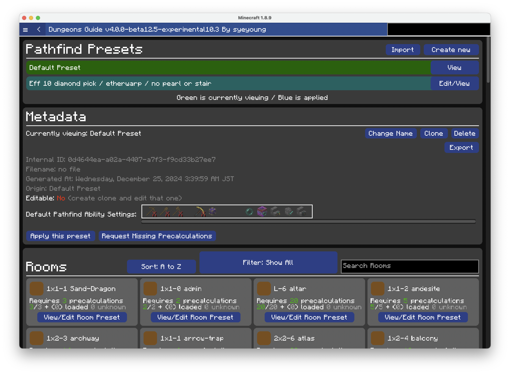
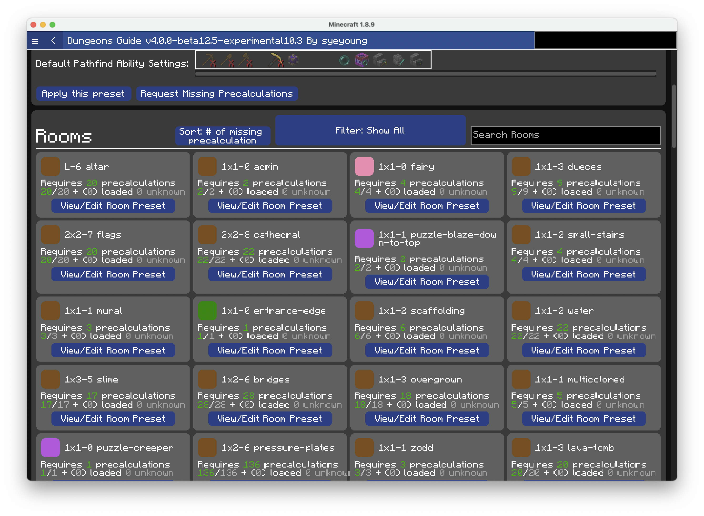

# Precalculate Locally

You can also run precalculation on your pc.

:::warning

This article is the only place you're going to get instructions. NO SUPPORT will be provided on this or on dms.

:::

Steps 1\~3 and 10\~11 are identical to [Precalculate on Cloud](./precalculate-on-cloud)

### Step 1. Make sure you have preset ready

Following `/dg -> Pathfinding & Secrets -> Precalculations` You'll be greeted with following page.

Click `View` or `Edit/View` on the preset that has your desired ability settings, or proceed after creating one following the [guide](/docs/pathfinding/presets/creating-preset)

The chosen preset will be highlighted with green

Confirm your default pathfind ability settings on the preset.

### Step 2. Request missing precalculations

Click the button named `Request Missing Precalculation`.

Here confirm 
- required pathfind credits.
- the name of preset
- the # of precalc requests
- Estimated time

The value depends on your computer, but in the screenshot 
- 7567 credits are required
- the preset is named Default Preset
- there are 2870 precalc requests
- it is estimated to take about 35 minutes

### Step 3. Generate Zip

After you have confirmed the values, click generate zip.

Progress bar will appear showing current progress of generating precalculation requests.

It takes few minutes to generate all precalculation requests.

After it has generated all the requests it will continue with zipping the requests.

### Step 4. Git clone Pathfinder Repository

C++ Pathfinder is located at [this github repository](https://github.com/Dungeons-Guide/Pathfinder)

Please git clone

### Step 5. Build C++ Pathfinder

Using your favorite build tools, build the pathfinder.

Please don't ask developer for the instruction to build C++ Pathfinder on your pc. Maybe use ChatGPT, it can help you out with setting up build env.

### Step 6. Get the zip from step 3.

Click Open Directory on bottom right, and find the generated pf req file.
The file name of the generated file also can be found in the chat.

### Step 7. Unzip the file

Create new `requests/` directory under pathfinder.

Unzip all the files into that.

Also create new `results/` directory under pathfinder

### Step 8. Run precalculation

run `./processFiles.sh`. The file is simple enough that you can modify it to change your cpu count and stuff.

### Step 9. Get results

The resulting precalculation files should be `results/` directory.

Create new directory under `.minecraft/config/dungeonsguide/precalculation`, and paste all the resulting files into that directory.

Restart the Minecraft

### Step 10. Confirm precalculations are installed

Go back to `/dg -> Pathfinding & Secrets -> Precalculations` and choose the preset you requested precalculation on.

Click on `Sort` to change it to `Sort: # of missing precalculation` and confirm that the preset is not missing any precalculations

If your new preset is not set to default (i.e. applied), Click `Apply this preset` to apply it and use it in your runs.

### Step 11. Done!

You have successfully precalculated for a preset and applied the resulting precalculations.

Please note any change to ability setting in the preset will require the precalculations to be recalculated to reflect those new ability settings.

Use the `clone` button to clone preset first then change abiltiy setting. 